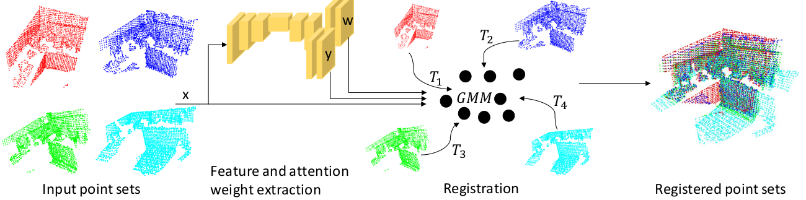

# RLLReg

This repository contains a Pytorch implementation of the point set registration method RLLReg. Details about the method can be found in the 3DV 2020 paper "<em>Registration Loss Learning for Deep Probabilistic Point Set Registration</em>".

ArXiv: [[paper]](https://arxiv.org/abs/2011.02229)



If you find the code useful, please cite using

    @InProceedings{Lawin_2020_3DV,
        author = {Felix J\"aremo Lawin and Per-Erik Forss\'en},
        title = {Registration Loss Learning for Deep Probabilistic Point Set Registration},
        booktitle = {{IEEE/CVF} International Virtual Conference on 3D Vision ({3DV})},
        month = {November},
        year = {2020}} 


## Installation
* Clone the repository: `git clone https://github.com/felja633/RLLReg.git`
* Create a conda environment and install the following dependencies:
```shell script
conda create -n rllreg python=3.7
conda activate rllreg
conda install -y numpy pathlib mkl-include pyyaml
conda install -y pytorch==1.6.0 torchvision==0.7.0 cudatoolkit=10.2 -c pytorch
conda install -y -c conda-forge cudatoolkit-dev
pip install easydict visdom
pip install git+https://github.com/jonbarron/robust_loss_pytorch
conda install -y -c open3d-admin open3d

```
* Install MinkowskiEngine with GPU support. Follow instructions for conda environment on https://github.com/NVIDIA/MinkowskiEngine
```shell script
git clone https://github.com/NVIDIA/MinkowskiEngine.git
cd MinkowskiEngine
python setup.py install --cuda_home=/path/to/conda/rllreg 
```
* Install pytorch geometric from https://github.com/rusty1s/pytorch_geometric
```shell script
pip install torch-scatter==latest+cu102 -f https://pytorch-geometric.com/whl/torch-1.6.0.html
pip install torch-sparse==latest+cu102 -f https://pytorch-geometric.com/whl/torch-1.6.0.html
pip install torch-cluster==latest+cu102 -f https://pytorch-geometric.com/whl/torch-1.6.0.html
pip install torch-spline-conv==latest+cu102 -f https://pytorch-geometric.com/whl/torch-1.6.0.html
pip install torch-geometric
```
## Datasets

### Kitti 
Download and unpack Velodyne scans from http://www.cvlibs.net/download.php?file=data_odometry_velodyne.zip

### 3DMatch
Download RGB-D scenes from http://3dmatch.cs.princeton.edu/ using http://vision.princeton.edu/projects/2016/3DMatch/downloads/rgbd-datasets/download.sh and unpack the file. Download [train.txt](https://drive.google.com/file/d/1iqscnHcbISlaxDTKwDRJPr69c9oMXK90/view?usp=sharing) and [test.txt](https://drive.google.com/file/d/1MpRjwXfZBns_8uKFOfb7_akMncdBau-e/view?usp=sharing). These contain the official train/test splits which can be found in the file https://vision.princeton.edu/projects/2016/3DMatch/downloads/rgbd-datasets/split.txt. Place these text files in the 3DMatch dataset folder.

## Configuration
Set up your local environment by setting the correct paths for your system in [config.py](config.py). Here you should set the paths to the datasets and pre-trained models.

## Models
The following pre-trained models are available for download: 

| Name            |  Training set       | Weights  |
|-----------------|:------------------:|:--------:|
| RLLReg_threedmatch.pth  |  3DMatch         | [download](https://drive.google.com/file/d/1Tls9t2kL8rIdjgQf_vVoBhsSrryZ5bNm/view?usp=sharing) |
| RLLReg_threedmatch_multi.pth | 3DMatch | [download](https://drive.google.com/file/d/1YCAafw8llfpr-5iZ1rvAjIANmsawdpEN/view?usp=sharing)
| RLLReg_kitti.pth | Kitti         | [download](https://drive.google.com/file/d/1GviNJIjpXn5oExpo2-0xtaF4Z8UNLJth/view?usp=sharing) |
| RLLReg_kitti_multi.pth   |  Kitti | [download](https://drive.google.com/file/d/1KxTQQ81W1EH_CXwo9IfhBnydFW8lSdpS/view?usp=sharing) |

For the version trained with contrastive loss, use the following models from https://github.com/chrischoy/FCGF

| Name            |  Training set       | Weights  |
|-----------------|:------------------:|:--------:|
| 2019-08-16_19-21-47.pth  |  3DMatch         | [download](https://node1.chrischoy.org/data/publications/fcgf/2019-08-16_19-21-47.pth) |
| KITTI-v0.3-ResUNetBN2C-conv1-5-nout16.pth | Kitti         | [download](https://node1.chrischoy.org/data/publications/fcgf/KITTI-v0.3-ResUNetBN2C-conv1-5-nout16.pth) |

To further enable comparisons to DGR, download the weights for [3DMatch](http://node2.chrischoy.org/data/projects/DGR/ResUNetBN2C-feat32-3dmatch-v0.05.pth) and [Kitti](http://node2.chrischoy.org/data/projects/DGR/ResUNetBN2C-feat32-kitti-v0.3.pth).

Place all pre-trained weights in the same folder and set pretrained_networks to the path of that folder in [config.py](config.py).

## Running evaluations
Scripts for evaluation are available at experiments/. For an evaluation of pairwise registration as described in the paper run:

```
python experiments/evaluation_kitti.py
```

## Training
Scripts for training are available at experiments/. If you want to train RLLReg for pairwise registration run: 

```
python experiments/train_rll_kitti.py
```

## Additional implementations
This repository also includes a pytorch version of Density Adaptive Point Set Registration ([DARE](https://github.com/felja633/DARE)) and Joint Registration of Multiple Point Clouds ([JRMPC](https://team.inria.fr/perception/research/jrmpc/)). 
Further, models/feature_reg_model_fcgf_fppsr.py and models/feature_reg_model_fpfh_fppsr.py contain pytorch implementations of [FPPSR](https://ieeexplore.ieee.org/stamp/stamp.jsp?tp=&arnumber=7899641) using FCGF and FPFH features respectively.

Under external/DeepGLobalRegistration the official implementation of [DGR](https://github.com/chrischoy/DeepGlobalRegistration) is located. The code is copied from the original repository but it is modified to use relative paths.
## Contact
Felix Järemo Lawin

email: felix.jaremo-lawin@liu.se

## Acknowledgements

* To compute the robust loss we use the code from https://github.com/jonbarron/robust_loss_pytorch

* We construct a backbone feature extractor based on the network from FCGF in https://github.com/chrischoy/FCGF

* In the comparison with DGR we use the code from https://github.com/chrischoy/DeepGlobalRegistration

* For the comparisons with ICP and FGR we use the implementations from Open3D http://www.open3d.org/

* The registration code was built upon the code for DARE in https://github.com/felja633/DARE

* The original implementation for JRMPC can be found in https://team.inria.fr/perception/research/jrmpc/
